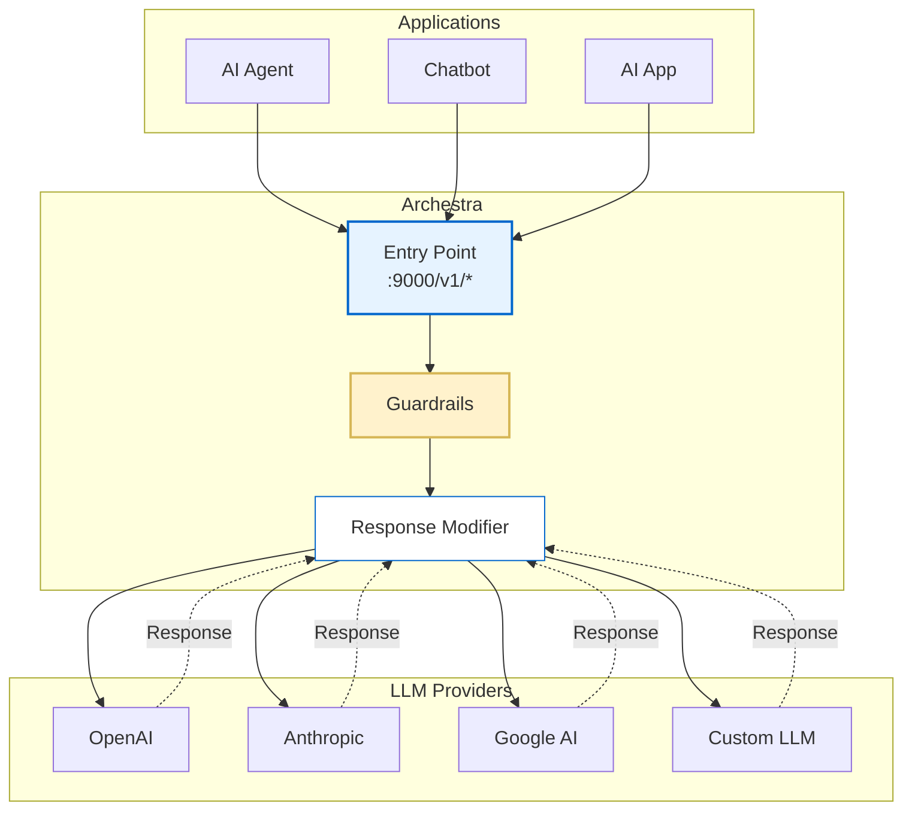

LLM Proxy is Archestra's security layer that sits between AI agents and LLM providers (OpenAI, Anthropic, Google, etc.). It intercepts, analyzes, and modifies LLM requests and responses to enforce security policies, prevent data leakage, and ensure compliance with organizational guidelines.

## To use LLM Proxy:

Go to "Profiles" -> Connect Icon -> You'll get connection instructions.

