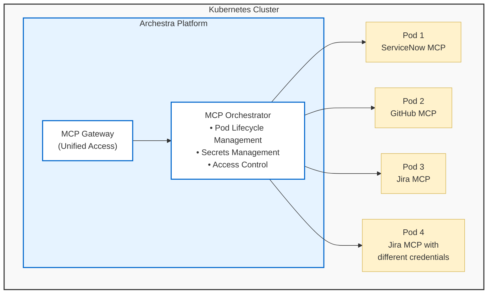

The MCP Orchestrator is Archestra's system for running and managing MCP servers within your existing Kubernetes cluster. It handles the lifecycle of MCP server pods, manages their secrets securely, and provides unified access through the MCP Gateway.

> **Note:** The MCP Orchestrator requires a Kubernetes (K8s) cluster to operate. You still could use Private MCP Registry, MCP Gateway and security features with remote MCP servers, or self-host them and connect to Archestra.

## How It Works

Each MCP server runs as a dedicated pod in your Kubernetes cluster:

- **One Pod Per Server**: Each MCP server gets its own isolated pod
- **Automatic Lifecycle**: Pods are automatically created, restarted, and managed
- **Custom Images**: Supports both standard and custom Docker images for MCP servers
- **Secret Management**: The orchestrator injects credentials and configuration.
